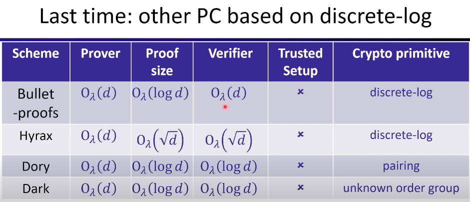

# Zero-Knowledge Proofs & ZKML Learning Notes

1️⃣ Ethereum (Computation) → Smart contracts and on-chain logic.
2️⃣ Swarm (Storage) → Decentralized file storage (IPFS alternative).
3️⃣ Whisper (Messaging) → Secure, private communication layer.

- Pairing based snark
- Code based snark
- Lattice based snark
- Linearly Homomorphic
- Ring based aitai commitmnet
- Integer based

1️⃣ Transaction Submission (Users & Bots)
2️⃣ Mempool Monitoring & Order Flow (Searchers, Private Relays)
3️⃣ MEV Search & Strategy Execution (Arbitrage, Sandwich, Liquidations) front run back run
4️⃣ Transaction Bundling & Ordering (Searchers & Builders)
5️⃣ Block Building & Proposal (Block Builders & Validators)
6️⃣ MEV Extraction & Redistribution (Validators & PBS)

SUAVE (Flashbots' new architecture) 

A Based Rollup is a type of Ethereum Layer 2 (L2) rollup that delegates sequencing and transaction ordering to Ethereum validators instead of using a separate sequencer set

AMM
Constant Product Market Maker (CPMM) — Uniswap v2 Model
Constant Sum Market Maker
Constant Mean Market Maker (CMMM) — Balancer Model

Slippage

Proof of Authority (PoA): A Consensus Mechanism
Proof of Authority (PoA) is a consensus algorithm used in blockchains where a fixed set of validators (authorities) are pre-approved to validate transactions and produce blocks. Unlike Proof of Work (PoW) or Proof of Stake (PoS), PoA relies on identity-based reputation rather than computational power or stake size.

MEV
- Mempool - Searcher - Builder - Proposer 
- Proposer pre confirmation

Property
- Safety
- Liveness

## Topics

* Finite Fields
* Elliptic Curves
* Polynomials
* STARKs
* Symmetric Encryption
* Interactive Proofs and SNARKs
* Plonk
* Lookup Arguments
* Signatures
* Folding Schemes

---

## Video Resources

#### Blockchain & Web3 MOOCs

* [Blockchain-Web3 MOOCs](https://www.youtube.com/@BerkeleyRDI/playlists)

### ZKP Lectures

#### Lecture 1: Introduction to Zero Knowledge Interactive Proofs (Part 1)

* [Lecture Link](https://www.youtube.com/watch?v=i2nxdrMsEEk&list=PLS01nW3RtgorR09s4cIz3aFylYCrk8fv0) ✅
* Completeness
* Soundness
* Simulator and real view should be computationally distinct
* One-way function then ZK
  * Hiding
  * Binding
* Interactive zero knowledge proof
* Fiat-Shamir transform

#### Lecture 2: Overview of Modern SNARK Constructions (Part 1)

* [Lecture Link](https://www.youtube.com/watch?v=MUnlR3gMKu0&list=PLS01nW3Rtgoo_0Y-X5bQ32SyDbMiGFqee) ✅
* Proof is short and fast to verify
* A single PC can monitor or verify many unreliable/untrusted computers
* Scalability – Rollup
* Cross-chain bridging (check if fund is locked)
* Private transactions
* Compliance
* Embedding SNARK in media (e.g., photo)
* Arithmetic Circuit:
  * Structured
  * Unstructured
* Succinct: sublinear verification (√n or log n)
* Preprocessing:
  * Trusted
  * Trusted and universal
* SNARK Constructions:
  * Groth16
  * Plonk
  * Bulletproofs
  * STARK
* Knowledge soundness via extractor
* SNARK construction:
  * Functional Commitment Scheme:
    * Polynomial Commitment
    * Multilinear Commitment
    * Vector Commitment
    * Inner Product Commitment
    * KGZ – trusted setup
    * Dory – no setup
    * FRI – long proof
    * Bulletproof
    * Dark
  * Trivial commitment scheme: send coefficients
* SZDL Lemma
* Fiat-Shamir: transform public coin protocols into non-interactive
* IOP (Interactive Oracle Proof)
* SNARK DSL → SNARK-friendly format → SNARK backend prover

#### Lecture 3: Programming ZKPs (Part 1)

* [Lecture Link](https://www.youtube.com/watch?v=kho-vcQGa0c&list=PLS01nW3RtgoqqvF39f11ncNAClgSLPlXD) ✅
* Predicate system R1CS
* Arworks constraint system
* Circom direct constraints
* Zokrates
* Target: R1CS, Plonk, AIR
* Circ

#### Lecture 4: Interactive Proofs (Part 1)

* [Lecture Link](https://youtu.be/7YXVGDtuHrk?list=PLS01nW3RtgopePvLcZgMJK8gC5trUWVsT)
* Basic IP + PCS
* Polynomial Commitment
* Multilinear Commitment
* Vector Commitment (Merkle commitment)
* Polynomial evaluation over domain proportionate to degree d
* Multivariate reduces total degree
* Extend {0,1}^l → F^L
* Multilinear polynomials have lower total degree than coefficients
* Evaluation over 2^l gives guarantee for F^l

#### Lecture 5: The Plonk SNARK (Part 1)

* [Lecture Link](https://www.youtube.com/watch?v=tAdLHQVWlUY&list=PLS01nW3Rtgopdkrlu2-Lqgg7MKIS2vv2J)
* Plonk IOP + KGZ → Aztec, Jellyfish
* Plonk IOP + Bulletproofs → Halo2
* Plonk IOP + FRI → Plonky2

#### Lecture 6: Polynomial Commitments based on Pairing and Discrete Logarithm

* [Lecture Link](https://www.youtube.com/watch?v=HdwMtrXLLWk&list=PLS01nW3RtgopRnH84Omx0C4yZo75uSHWO)

* Functions:
  * keygen(gamma, F) → global param
  * commit(gp, f) → commitment
  * eval(gp, f, u) → v, π
  * verify(gp, com, u, v, f) → accept/reject
* Groups: multiplicative/additive notation
* Discrete Log problem: hard
* Bulletproof, Hyrax, Dark
* Bilinear pairings: Diffie-Hellman assumption
* BLS signature
* KGZ
* Pairing allows verification of exponent product relationships
* GGM can reduce commitment size
* Multivariate KGZ

#### Lecture 7: Polynomial Commitments based on Error-Correcting Codes

* [Lecture Link](https://youtu.be/cxtZfAHBTZM?list=PLS01nW3RtgopEpcPnXiXsHPO8HsaGUgmd)
* KGZ, gp, g^f(τ), g^q(x)
* Bulletproof, Hyrax, Dory, Dark
* ECC: larger, no homomorphism, no aggregation
* Ligero, STARK
* Sample hash, commit, Merkle
* Proximity test
* Consistency test

#### Lecture 8: FRI-based Polynomial Commitments and Fiat-Shamir

* [Lecture Link](https://youtu.be/cKvld6QWi7s?list=PLS01nW3RtgorRZsBnqch6gGBStZB9VVr)
* IOP: IP, MIP, Constant Round IOP (Plonk Spartan)
* Commitments: pairing-based, discrete log-based, hash-based

#### ZKP MOOC Lecture 10: Recursive SNARKs

* [Lecture Link](https://www.youtube.com/watch?v=0LW-qeVe6QI) ✅
* Snark construction: Groth, KGZ Plonk, FRI based (Short prover time, long proof)
* Recusrsive snarks
    * no proof of witness
    * proof of a proof on witness
* Fiat shamir to transform interactive to non-interactive
* Streaming proof geenration
* Incrementally verifiable computation - less memory requirement - task distributrd

#### Lecture 11: From Practice to Theory (Part 1)

* [Lecture Link](https://www.youtube.com/watch?v=mWx70mIElpE&list=PLS01nW3RtgortBgR8sznyBbYvS2R63fe0) ✅
* Fiat-Shamir → SNARG
* Hash functions with correlation intractibility
* Fully Homomorphic Encryption
* Polynomial & Vector commitments
* SNARGS for batch NP
* Sumcheck → GKR

#### Lecture 12: zkEVM Design, Optimization and Applications (Part 1)

* [Lecture Link](https://www.youtube.com/watch?v=OfQd_D-TRr8&list=PLS01nW3RtgoqV9S-crVXIkMoaE1JRJwML) ✅
* Recursive proofs
* zkEVM: language, bytecode, consensus level
* Build zkEVM: program → constraint → proof
* R1CS → IOP + PCS
* Plonkish + Plonk IOP + KGZ
* Blockchain attestation: rerun transactions to generate state root

#### ZK Whiteboard Sessions - S2M4: Risc-V ZKVMs with Uma Roy

* [Lecture Link](https://www.youtube.com/watch?v=Y4kIgPm95WM) ✅
- STARK
- FRI
- AIR
- Log Derivative Lookup Argument
- Risk Instruction
- Check memory, program counter, value
- CPU table
- Add Table: Instruction specific Contraint
- Mul Table
- Shift table
- Each table has many extra witness data, not to be inserted in CPU table
- Memory
  - Merklized
  - Read open proof
  - Write Update proof
  - Add tuple to lookup argument accumulator
  - Total 0
  - keccak Table
  - STARK to SNARK
  - plonkish-kgz
  - Hash based vs pairing based
  - CPU circuits, optimized by precompiler, alu specific circuits
  - Aggregation circuit for FRI
  - FRI (100kb) to SNARK (100 bytes) 

#### Constraints

* **R1CS:** linear combination
* **Plonkish:** custom gates, lookups (efficient range, connect, mapping), permutation, generalized for AIR
* **AIR:** STARK, [AirAssembly Spec](https://github.com/GuildOfWeavers/AirAssembly/tree/master/specs)

#### zkEVM Implementations

* Polygon Hermez: Stark, FPlonk
* zkEVM: Halo2 + KGZ

#### GPU Prover Optimizations

* MSM: inner product over elliptic curves
* NTT: FFT over finite fields

#### Other Notes

* FRI with Goldilocks, Mersenne Prime
* Polynomial Commitment + IOP → KGZ + Plonk IOP
* Sumcheck protocol: Boolean hypercube
  * [Video Reference](https://www.youtube.com/watch?v=XV62OB022tU&t=41s)

#### ZKP Applications

* ML model privacy
* Matrix multiplication proofs: sublinear verification

#### Lecture 14: ZKP Applications

* [Lecture Link](https://www.youtube.com/watch?v=tbEsv2afhko&list=PLS01nW3Rtgor9mqIK8fqtEwqxg_aP2lr2)

#### Lecture 15: Secure ZK Circuits with Formal Methods (Part 1)

* [Lecture Link](https://www.youtube.com/watch?v=8VO1vS14ul0&list=PLS01nW3RtgorMPv-awIn16HAdmyfIqsNj)

#### ZKP MOOC Notes

* [Substack Notes](https://domsteil.substack.com/p/zkp-mooc)

#### Ethereum Node Synchronization

#### Full Sync

* Downloads every block from genesis
* Replays and executes every transaction
* Verifies transaction and contract state
* Node has full history and current state

#### Fast Sync

* Downloads only block headers
* Downloads snapshot of state (accounts, balances, contracts) after a recent block
* Faster: skips replaying all transactions from genesis

#### Light Sync

* Downloads only block headers
* Relies on full nodes for specific information
* Does not store full state or history

**Note:** Full sync executes all transactions; fast sync avoids this by directly obtaining current state.
